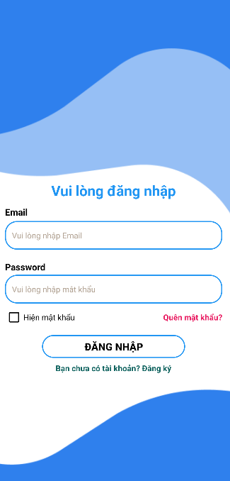
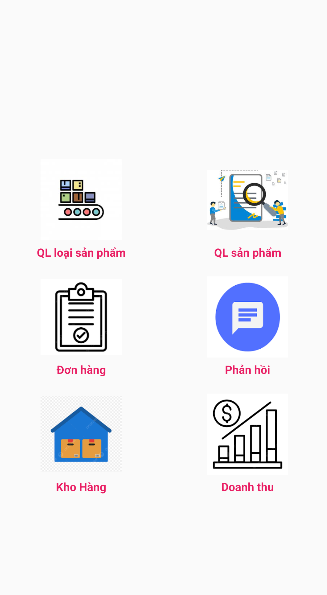
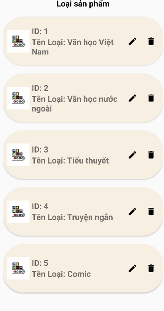
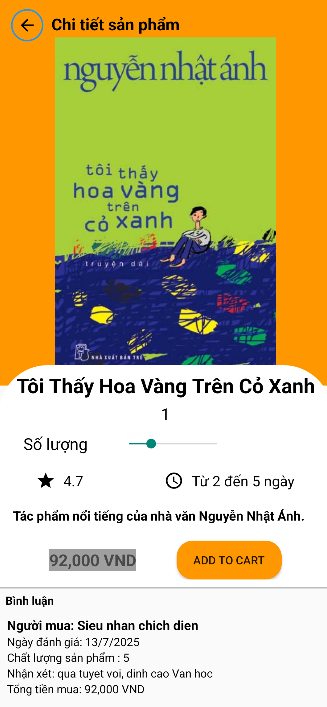
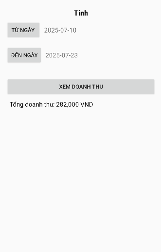

# 📚 Ứng dụng Android Mua Bán Sách – Nhóm 12

Ứng dụng Android cho phép người dùng duyệt sách, tìm kiếm, thêm vào giỏ hàng và đặt mua sách. Quản trị viên có thể quản lý sách, đơn hàng và doanh thu. Dữ liệu được lưu trữ cục bộ bằng SQLite. Giao diện thân thiện, dễ sử dụng, phù hợp với sinh viên và người dùng phổ thông.

## 🚀 Tính năng chính

### 👤 Người dùng

* Đăng ký và đăng nhập tài khoản
* Duyệt danh mục sách, sách nổi bật
* Tìm kiếm sách theo từ khóa
* Xem chi tiết sách
* Thêm vào giỏ hàng và đặt mua
* Xem lịch sử mua hàng
* Đánh giá sản phẩm

### 🔧 Quản trị viên (Admin)

* Quản lý danh mục sách
* Thêm, sửa, xóa sản phẩm
* Xem và xác nhận đơn hàng
* Theo dõi doanh thu
* Trả lời đánh giá và tin nhắn người dùng

## 🛠️ Công nghệ sử dụng

| Thành phần         | Công nghệ                       |
| ------------------ | ------------------------------- |
| Ngôn ngữ lập trình | Java                            |
| IDE                | Android Studio                  |
| Lưu trữ dữ liệu    | SQLite                          |
| UI Layout          | XML + ConstraintLayout          |
| Kiến trúc          | MVC (Model - View - Controller) |
| Hiển thị danh sách | RecyclerView + Adapter          |

## 📂 Cấu trúc thư mục

```plaintext
Sach/
├── model/               # Các lớp dữ liệu (User, Product, Order, ...)
├── dao/                 # Lớp truy vấn dữ liệu SQLite
├── activity/            # Màn hình chính (MainActivity, LoginActivity, ...)
├── fragment/            # Các giao diện fragment: Trang chủ, Giỏ hàng, ...
├── adapter/             # Adapter cho RecyclerView
├── database/            # DatabaseHelper.java
├── res/                 # Giao diện XML
└── ...
```

## 📱 Giao diện mẫu

| Người dùng                                    | Admin                                               |
| --------------------------------------------- | --------------------------------------------------- |
|                |  |
|             |        |
|  |                |


## 🧪 Cách chạy ứng dụng

1. **Clone dự án về máy:**

   ```bash
   git clone https://github.com/MinDuck404/Sach.git
   ```

2. **Mở bằng Android Studio**

3. **Build project**

4. **Chạy thử trên trình giả lập hoặc thiết bị Android thật**

## 🔐 Lưu ý

* Ứng dụng hoạt động offline, không cần kết nối internet
* Dữ liệu lưu cục bộ bằng SQLite, không hỗ trợ đồng bộ cloud
* Chưa tích hợp thanh toán trực tuyến

## 💡 Hướng phát triển

* Tích hợp thanh toán MoMo, ZaloPay
* Chuyển dữ liệu sang Firebase/Room để hỗ trợ đồng bộ
* Thêm chức năng gợi ý sách và gắn tag
* Cho phép người dùng gửi hình ảnh đánh giá
* Phân quyền người dùng và nhân viên rõ ràng hơn
* Tạo REST API để kết nối backend riêng

## 👨‍💼 Nhóm phát triển

| Họ và tên            | MSSV       | Vai trò     |
| -------------------- | ---------- | ----------- |
| Đặng Trần Minh Đức   | 2254810221 | Nhóm trưởng |
| Lê Huỳnh Hồng Nguyên | 2254810227 | Thành viên  |
| Văn Hồng Quân        | 2254810255 | Thành viên  |
| Đỗ Danh Toại         | 2254810251 | Thành viên  |
| Nguyễn Hoàng Việt    | 2331540177 | Thành viên  |

## 📄 Tài liệu tham khảo

* [Android SQLite Documentation](https://developer.android.com/training/data-storage/sqlite)
* [Vogella Android SQLite Tutorial](https://www.vogella.com/tutorials/AndroidSQLite/article.html)
* [YouTube – CodeWithMazn: SQLite Tutorial](https://www.youtube.com/watch?v=hJPk50p7xwA)
